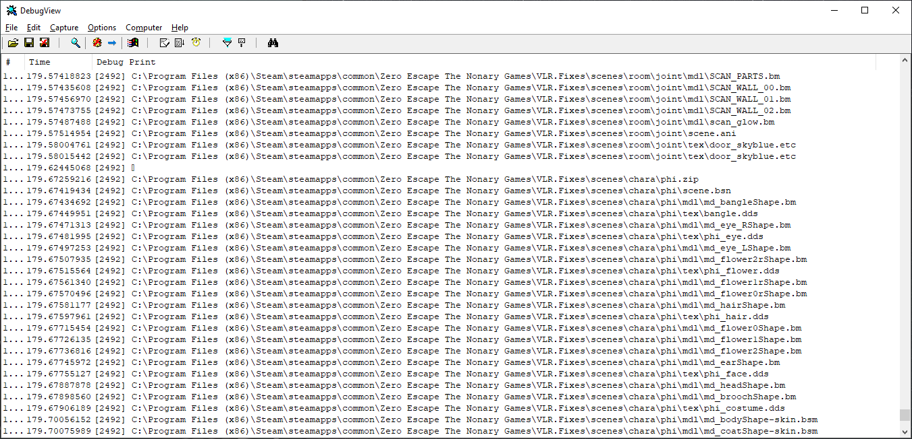

# Zero Escape: Virtue's Last Reward Fixes

An unofficial patch for the [Steam release](https://store.steampowered.com/app/477740/Zero_Escape_The_Nonary_Games/) of **Zero Escape: Virtue's Last Reward**.

## Features

* *Lip Animation Fix*: Fixes a bug where characters will maintain their default (neutral) mouth pose after talking. Also known as the infamous Clover smiling bug.

* *Skippable Transitions*: Skip map transitions, room titles, or the opening splash screen with the A button.

* *Custom Game Files*: Load uncompressed game files from a local directory if they exist instead of from ze2_data_en_us.bin.

## Installation

* Download the latest .ZIP file from the [Releases](https://github.com/Murugo/VLR.Fixes/releases) tab.
* Locate the installation folder for Zero Escape: The Nonary Games.
  * Right-click the game in your Steam library > Properties > Installed Files > Browse...
* Extract the .ZIP file and place these files in the same folder as `ze2.exe`:
  * `version.dll`
  * `VLR.Fixes.asi`
  * `VLR.Fixes.ini`
* Launch the game.

## Using Custom Game Files

The `CustomGameFiles` patch allows you to replace game files at runtime without having to repack the .BIN archive.

When the game requests a resource, the patch will first check if the path to the resource exists in a folder called `VLR.Fixes\` in the same directory as the game executable. Otherwise, the patch will fall back to the archive to load the file.

One way to discover these paths is to enable `DebugPrintGameFilePaths` in `VLR.Fixes.ini`. Each time the game tries to access a resource, the patch will debug print the location where it would expect to find a replacement in `VLR.Fixes\`.

You can use a tool such as [DebugView](https://learn.microsoft.com/en-us/sysinternals/downloads/debugview) to inspect these messages. Example output:

> **Note**: .AVI files are currently unsupported.

> **Note**: This feature may cause some slow-down due to frequent disk accesses. Installing the game on an SSD can help mitigate this issue. To disable the feature, set `CustomGameFiles = 0` in `VLR.Fixes.ini`.

## Credits

This patch is made possible by:

* [Ultimate ASI Loader](https://github.com/ThirteenAG/Ultimate-ASI-Loader/releases) by ThirteenAG (included in the .ZIP)
* [Hooking.Patterns](https://github.com/ThirteenAG/Hooking.Patterns) by ThirteenAG
