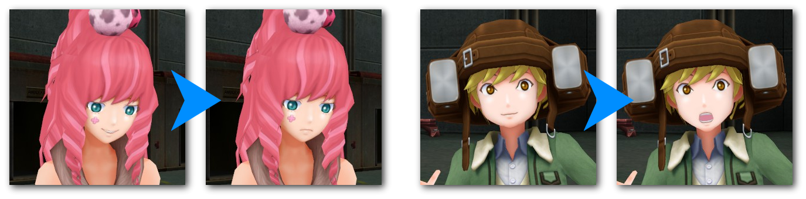

# Zero Escape: Virtue's Last Reward Fixes

An unofficial patch for the [Steam release](https://store.steampowered.com/app/477740/Zero_Escape_The_Nonary_Games/) of **Zero Escape: Virtue's Last Reward**. Currently, the patch contains a single fix:

* *Lip Animation Fix*: Fixes a bug where characters will maintain their default (neutral) mouth pose after talking, regardless of the body pose being used. Also known as the infamous Clover smiling bug.
  * Note that this fix will have a noticeable impact on *all* characters.

## Installation

* Download the latest .ZIP file from the Releases tab.
* Locate the installation folder for Zero Escape: The Nonary Games.
  * Right-click the game in your Steam library > Properties > Installed Files > Browse...
* Extract the .ZIP file and place these files in the same folder as `ze2.exe`:
  * `version.dll`
  * `VLR.Fixes.asi`
* Launch the game.

## Credits

This patch is made possible by:

* [Ultimate ASI Loader](https://github.com/ThirteenAG/Ultimate-ASI-Loader/releases) by ThirteenAG (included in .ZIP)
* [Hooking.Patterns](https://github.com/ThirteenAG/Hooking.Patterns) by ThirteenAG
